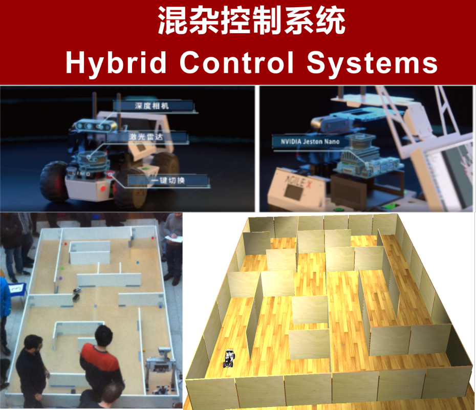
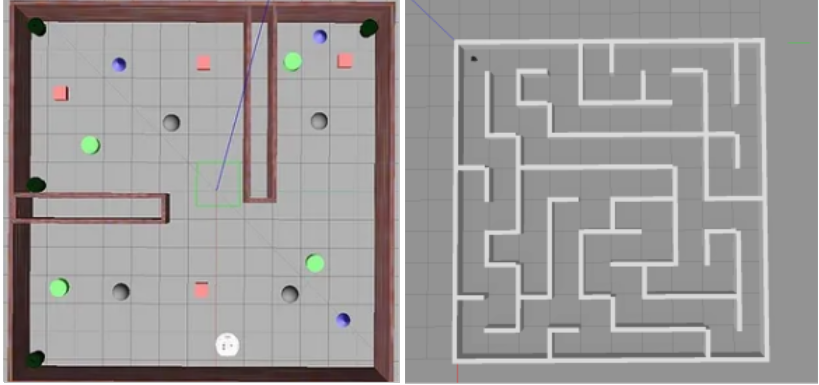
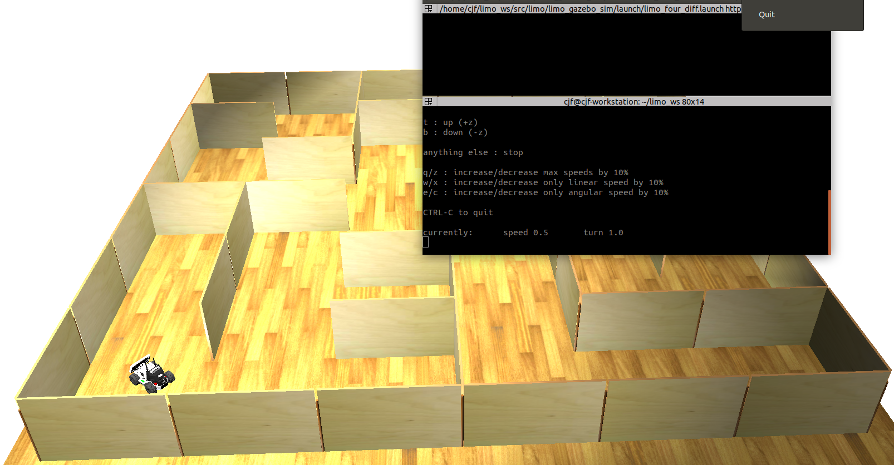

# 混杂控制系统课程比赛

> 🌟 **项目目标 ：未知场景下的多目标搜索救援** 🚀

[](https://github.com/your-username/awesome-library/blob/main/LICENSE)
[](https://github.com/JunfengChen-robotics/hybrid_control_match/stargazers)
[](https://github.com/JunfengChen-robotics/hybrid_control_match/issues)



<!-- ----------------------------------------------- -->
## 项目特征

- ✨ **导航控制**（离散时间系统）
- 🎨 **自主定位与建图**（离散时间系统）
- 📦 **路径规划**（离散时间系统）
- 💪 **目标识别**（离散时间系统）
- 🌈 **任务描述、规划、执行**（混杂系统）
- 🚀 **多机协同**（+++混杂系统）

****
<!-- ----------------------------------------------- -->
## 目录

- [混杂控制系统课程比赛](#混杂控制系统课程比赛)
  - [项目特征](#项目特征)
  - [目录](#目录)
  - [比赛介绍](#比赛介绍)
    - [比赛场景介绍](#比赛场景介绍)
    - [比赛规则介绍](#比赛规则介绍)
    - [比赛评分规则和要求](#比赛评分规则和要求)
  - [安装说明](#安装说明)
  - [使用说明](#使用说明)
  - [未来工作和组织者](#未来工作和组织者)

****
<!-- ----------------------------------------------- -->
## 比赛介绍

在机器人领域，在未知区域对指定目标或不同优先级顺序的目标进行搜索和救援是一个一直以来被学者所关心的问题。
本比赛旨在开发一种智能机器人，能在未知区域对特定目标进行搜索和救援操作。这个机器人具备先进的感知和决策能力，能够自主地探索和应对各种复杂环境，以提供有效的救援行动。
具体地：
- 机器人通过综合感知和自主决策，能够在未知区域进行全面搜索；
- 并持续通过搭载的先进图像识别技术和深度学习模型，能够准确地识别特定目标并锁定其位置；
- 之后通过内置的导航系统和传感器，自主规划路径并避开障碍物，快速到达指定区域进行救援活动。

### 比赛场景介绍

目前，我们提供两种任务场景，在给定的比赛时间（比如5min），对下面任选的一个场景进行仿真和现场测试，具体是：

```
1. 给定gazebo未知区域场景，以及不同颜色（红色，黄色，绿色等）目标，指定机器人对红色（比赛临时指定）进行边搜索边识别指定目标，在规定比赛时间内实现能够最大化找到的红色目标数量以及探索区域最大化这两项需求。
```

```
2. 给定gazebo未知场景，以及不同颜色（如上）目标，给出目标优先级（通过指定相应颜色的顺序），请在规定的比赛时间内将该未知区域探索完成，并根据发现的目标未知和优先级再给出救援顺序去实施救援。
```



### 比赛规则介绍

- 首先在提供的官方simulation模块对算法进行快速验证，再进一步部署到实物上进行测试和最终比赛；

- 最终比赛虽然在提供的包里场景进行测试，但是下列参数竟会被改变:
  - 比赛场景选择（easy，medium，hard）
  - 机器人初始位置
  - 重要目标颜色随机指定
  - 任务指定完成时间
  - 重要目标数量和位置随机给出


### 比赛评分规则和要求

- 评分规则
  - **第一种任务场景**
    - 建图的地图质量
    - 救援的指定目标数量
  
  - **第二种任务场景**
    - 完整建图的质量和时间
    - 带有优先级顺序目标sequential救援时间
    - **总时间最小**
  
- 比赛要求

  - 代码支持`**python**`和`**C++**`,并请大家规范使用github，
    可以以自己学号新建branch，并推送到助教管理的repository上；

  - 在开发过程中有问题，请在助教管理的repository上提Pull Request;
  
  - 比赛过程中，请将探索过程中建立的地图（.yaml和.png）保存下来以及救援的目标数量（.txt）记录下来；
  
  - 技术要求
    - 未知环境（现场搭建）
    - 目标位置，数量未知
    - 完全自主（无人工干预）
    - 可根据需求，利用开源包
    - 设备时间分配、仿真硬件细节，咨询助教
    - 鼓励组里、组间交流

  - 过程要求
    - Github代码课后允许助教公开和优化，共同助力该课程发展和完善
    - 记录每周分工与进度，作为课程总体评分依据
    - 中期、终期汇报+演示
    - 自我宣传


<!-- ----------------------------------------------- -->
## 安装说明

该部分提供详细的比赛的simulation下载和安装使用说明。

该比赛所使用的系统主要开发和测试在下列的系统属性上：

- Ubuntu18.04(请不要使用高于该版本的linux系统)
- ROS Melodic
- Gazebo 8.0~11.0
- Python2 (2.7~2.11)

1. 安装ROS Melodic
   
   ```
   参考 http://wiki.ros.org/melodic/Installation/Ubuntu
   ```

2. 下载该项目
   
   ```bash
   #create the workspace
   mkdir -p ~/limo_ws/src
   cd ~/limo_ws/src
   catkin_init_workspace

   # download the packages:

   git clone git@github.com:JunfengChen-robotics/hybrid_control_match.git

   ## build the workspace
   cd ..
   catkin_make
   source devel/setup.bash
   ```

3. 测试安装是否成功
   
   ```bash
   # start the gazebo simulation
   roslaunch limo_gazebo_sim limo_four_diff.launch

   # telep the limo 
   rosrun teleop_twist_keyboard teleop_twist_keyboard.py 
   ```
   如果启动并且出现如下场景，并且操控小车可以运动，则证明安装成功。

   

4. 注意事项
   
   如果安装中遇到少了依赖，请直接Google，大部分问题都是因为缺少必要的包所导致的，如下：
  
   ```bash
   #安装slam---gmapping包
   sudo apt-get install ros-melodic-gmapping

   #anzhuang map server用于保存地图
   sudo apt-get install ros-melodic-map-server
   
   #安装 move_base导航包和amcl定位包
   sudo apt-get install ros-melodic-navigation
   ```
    上述只是某些包，如果安装过程还有一些报错的包，请参考[ROS Answers](https://answers.ros.org/questions/)。

<!-- ----------------------------------------------- -->
## 使用说明
我们仿真提供了完成任务所必要的功能，比如：
- **SLAM建图功能**： 集成了[Gmapping](http://wiki.ros.org/gmapping), [hector](http://wiki.ros.org/hector_mapping)以及[cartographer](http://wiki.ros.org/cartographer)这三种建图工具；
- **导航功能**： 集成了[move_base](http://wiki.ros.org/move_base)常用的导航功能包；
- **搜索功能**： 集成了两种常用的未知环境中搜索建图工具      
  [rrt_exploration](http://wiki.ros.org/rrt_exploration)以及 [frontier_exploration](http://wiki.ros.org/frontier_exploration)。

- **目标识别**： 集成了[openCV](https://opencv.org/)对颜色的识别以及位姿估计;


该部分主要提供上述packages的每个meta packages的详细功能，以及操作案例。

1. meta package功能说明
   
   - ``limo_description``:  提供limo在仿真中urdf模型
   - ``limo_gazebo_sim``: 提供limo的在gazebo中仿真模型
   - ``telep_twist_keyboard``: 提供在gazebo中对limo的键盘控制
   - ``mbot_exlore``:提供未知环境搜索建图功能
   - ``mbot_navigation``:提供导航功能
   - ``mbot_slam``:提供建图功能，可以通过开启不同的luanch文件选择不同的建图方法
   - ``mbot_recognition``: 提供目标识别功能，也是该比赛的主功能包

<p align="center">
  
</p>

2. 功能和操作案例
   - ## **SLAM建图功能案例**
     - 操作指令
       ```bash
       # start the gazebo simulation
       roslaunch limo_gazebo_sim limo_four_diff.launch 

       # start the gmapping slam package
       roslaunch mbot_slam gmapping_demo.launch
       
       # start the keyboard control node
       rosrun teleop_twist_keyboard teleop_twist_keyboard.py 

       # save map
        rosrun map_server map_saver -f match_gmapping
       ```

     - **导航功能案例**
        - 操作指令
          ```bash
          # start the gazebo simulation
          roslaunch limo_gazebo_sim limo_four_diff.launch 

          # start the navigation node
          roslaunch mbot_navigation nav_match_demo.launch 
          ``` 

      - **半自主探索案例**
        - 操作指令
          ```bash
          # start the gazebo simulation
          roslaunch limo_gazebo_sim limo_four_diff.launch 

          # start the semi-auto exploration node
          roslaunch mbot_navigation exploring_slam_demo.launch  
          ```

      - **全自主探索案例**
        - 操作指令
          ```bash
          # start the gazebo simulation
          roslaunch limo_gazebo_sim limo_four_diff.launch 

          # start the fullly auto exploration node
          roslaunch mbot_explore rrt_exploration.launch  
          ```  
        <div style="display: flex; flex-wrap: wrap;">
        <div style="flex-basis: 50%; text-align:center;">
          
          <p>SLAM建图</p>
        </div>
        <div style="flex-basis: 50%; text-align:center;">
          
          <p>move_base导航</p>
        </div>
        <div style="flex-basis: 50%; text-align:center;">
          
          <p>半自主探索</p>
        </div>
        <div style="flex-basis: 50%; text-align:center;">
          
          <p>全自主探索</p>
        </div>
      </div>

       
<!-- 第一行 -->
  <!-- <div style="display: flex; flex-direction: row; justify-content: center;">
    <div>
      <video width="320" height="240" controls>
        <source src="videos/gmapping.mp4" type="video/mp4">
      </video>
        <p >SLAM建图</p>
    </div>
    <div>
      <video width="320" height="240" controls>
        <source src="videos/navigation.mp4" type="video/mp4">
      </video>
        <p>move_base导航</p>
    </div>
  </div> -->

<!-- 第二行 -->
<!-- <div style="display: flex; flex-direction: row; justify-content: center;">
  <div>
    <video width="320" height="240" controls>
      <source src="videos/semi-exploration.mp4" type="video/mp4">
    </video>
    <p>半自主探索</p>
  </div>
  <div>
    <video width="320" height="240" controls>
      <source src="videos/full-exploration.mp4" type="video/mp4">
    </video>
    <p>全自主探索</p>
  </div>
</div> -->


<!-- ----------------------------------------------- -->
## 未来工作和组织者

- **未来工作**
  - 目标识别和位姿估计： 开发测试中 💪
  - ``mbot_recogintion``： 正在开发和测试中 💪
  - 多机器人系统: 待开发✨

- 组织者
  - PI： @ Pro.Guo, COE, Peking University
  - TA： @ Dr.Chen, COE, Peking University
 

- 贡献指南

  🌈 欢迎对本项目做出贡献！请参阅贡献指南了解详细的贡献流程和规范。

- 联系我们
  
  请联系Dr.Chen通过以下邮箱：chenjunfeng@stu.pku.edu.cn
